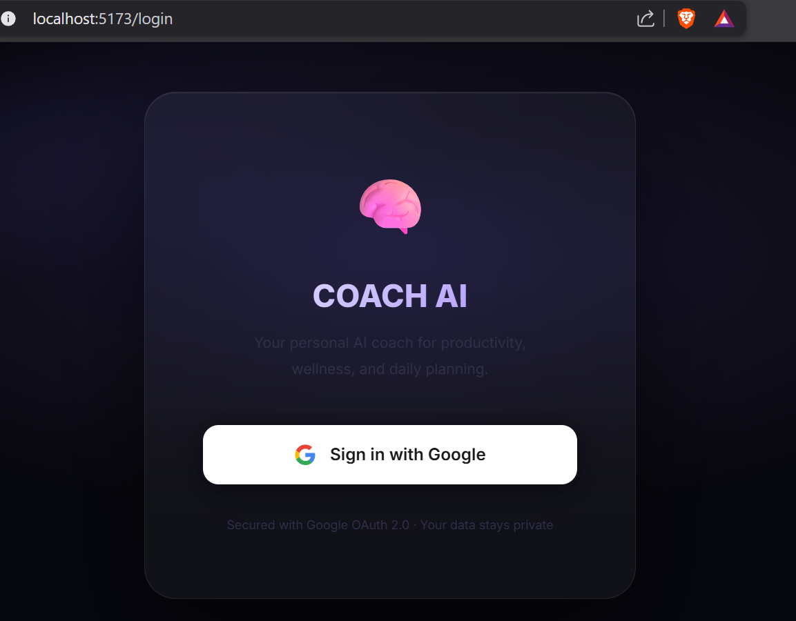
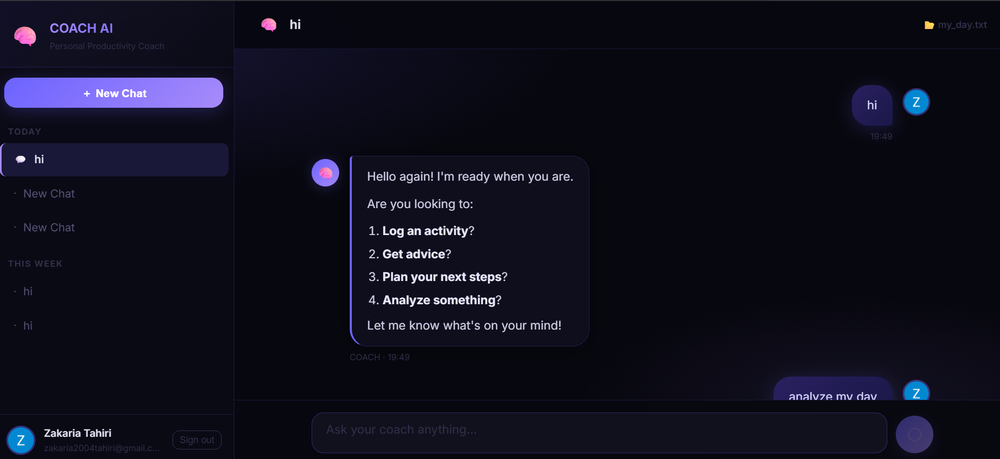
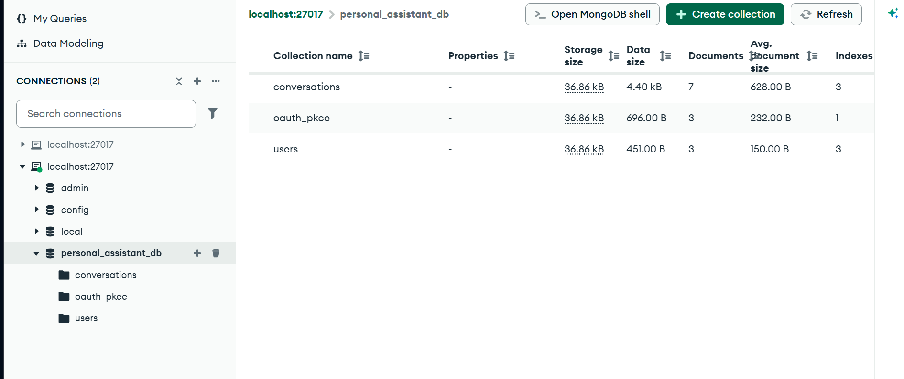

# COACH AI

COACH AI is a private, locally powered personal productivity coach. Users sign in with Google, upload a daily log as a text or PDF file, and chat with an Ollama-based assistant about productivity, sleep, exercise, nutrition, goals, and planning.

## Screenshots

### Google sign in



### Chat interface



### MongoDB collections



## Features

- Google OAuth 2.0 authentication
- Daily-log uploads in `.txt` and `.pdf` formats
- Streaming AI responses over Server-Sent Events
- Persistent conversations and user profiles in MongoDB
- Markdown and GitHub-Flavored Markdown rendering
- Conversation history grouped by date
- Local inference through Ollama
- Coach tools for productivity scoring, sleep analysis, exercise, nutrition, weather, web search, notes, plans, and Excel logging

## Technology stack

- **Frontend:** React 19, Vite, React Router, React Markdown
- **Backend:** Python, FastAPI, LangChain
- **Model runtime:** Ollama
- **Database:** MongoDB
- **Authentication:** Google OAuth 2.0 with PKCE and JWT cookies

## Project structure

```text
personal_assistant/
├── backend/
│   ├── auth.py            # Google OAuth and JWT helpers
│   ├── coach_engine.py    # LangChain/Ollama agent construction
│   └── main.py            # FastAPI routes and streaming chat API
├── frontend/
│   ├── public/
│   └── src/               # React pages, components, styles, and API client
├── docs/screenshots/      # Images used by this README
├── Coach.py               # Coach tools, prompt, and CLI application
├── db.py                  # MongoDB connection and data helpers
└── requirements.txt       # Python dependencies
```

## Prerequisites

Install the following before starting the application:

- Python 3.13+
- Node.js and npm
- MongoDB
- [Ollama](https://ollama.com/)
- A Google OAuth 2.0 web application

Pull the default local model:

```bash
ollama pull gemma4:e2b
```

You can use another Ollama model by changing `OLLAMA_MODEL` in `.env`.

## Installation

Clone the repository:

```bash
git clone https://github.com/zakariatahi/coach-chatbot.git
cd coach-chatbot
```

Create and activate a Python virtual environment:

```bash
python -m venv .venv
```

Windows PowerShell:

```powershell
.\.venv\Scripts\Activate.ps1
pip install -r requirements.txt
```

macOS or Linux:

```bash
source .venv/bin/activate
pip install -r requirements.txt
```

Install the frontend dependencies:

```bash
cd frontend
npm install
cd ..
```

## Environment configuration

Create a `.env` file in the repository root:

```dotenv
MONGO_URI=mongodb://localhost:27017
DB_NAME=personal_assistant_db

GOOGLE_CLIENT_ID=your-google-client-id
GOOGLE_CLIENT_SECRET=your-google-client-secret
GOOGLE_REDIRECT_URI=http://localhost:8000/auth/google/callback

SECRET_KEY=replace-with-a-long-random-secret
FRONTEND_URL=http://localhost:5173
OLLAMA_MODEL=gemma4:e2b
```

Add this authorized redirect URI to the Google OAuth application:

```text
http://localhost:8000/auth/google/callback
```

> [!IMPORTANT]
> Never commit `.env`. It is ignored by Git and may contain database credentials, OAuth secrets, and the JWT signing key.

## Running the application

Make sure MongoDB and Ollama are running, then start the backend from the repository root:

```bash
uvicorn backend.main:app --reload --host 127.0.0.1 --port 8000
```

In a second terminal, start the frontend:

```bash
cd frontend
npm run dev
```

Open [http://localhost:5173](http://localhost:5173), sign in with Google, and upload a `.txt` or `.pdf` daily log to begin chatting.

## API overview

| Method | Endpoint | Purpose |
| --- | --- | --- |
| `GET` | `/auth/google/url` | Create the Google OAuth authorization URL |
| `GET` | `/auth/google/callback` | Complete Google OAuth login |
| `GET` | `/auth/me` | Return the authenticated user |
| `POST` | `/auth/logout` | Clear the authentication cookie |
| `POST` | `/api/upload` | Upload a daily log |
| `GET` | `/api/log-status` | Return the current upload status |
| `GET` | `/api/sessions` | List the user's conversations |
| `POST` | `/api/sessions` | Create a conversation |
| `GET` | `/api/sessions/{id}/messages` | Load conversation messages |
| `POST` | `/api/chat` | Stream a coach response using SSE |

FastAPI's interactive API documentation is available at [http://localhost:8000/docs](http://localhost:8000/docs) while the backend is running.

## Development checks

Build and lint the frontend:

```bash
cd frontend
npm run lint
npm run build
```

Confirm that the backend imports successfully:

```bash
python -c "import backend.main; print('Backend import successful')"
```

## Privacy and security

- `.env`, virtual environments, generated coach files, personal daily logs, and local project data are excluded from Git.
- Authentication cookies are HTTP-only.
- Uploaded log contents and active agent state are currently held in backend memory and are cleared when the server restarts.
- Conversation history and user-profile data are stored in MongoDB.
- Review the deployment configuration before exposing the app publicly; the current defaults are intended for local development.

## Troubleshooting

### The frontend cannot reach the API

Confirm that FastAPI is running on port `8000`. Vite proxies `/api` and `/auth` requests to that port.

### Google sign-in fails

Check `GOOGLE_CLIENT_ID`, `GOOGLE_CLIENT_SECRET`, and `GOOGLE_REDIRECT_URI`. The redirect URI must exactly match the one configured in Google Cloud Console.

### Chat does not respond

Confirm that Ollama is running and that the configured model is installed:

```bash
ollama list
```

### MongoDB errors

Confirm that MongoDB is reachable at `MONGO_URI` and that the configured user has permission to create collections and indexes.


